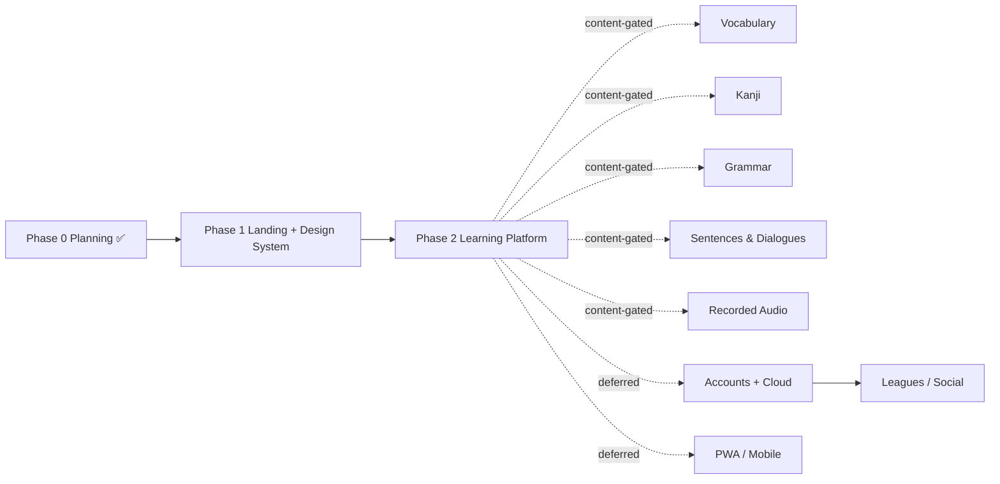

# Japalingo — Roadmap

> **Learn to read Japanese — the fun way.**
> The delivery plan for Japalingo, a playful, gamified web app to master Hiragana & Katakana, guided by **Hoshi the Shiba Inu**.

This is the single delivery plan. It is **content-gated**: every learning fact ships from `/database` (the two Tofugu books) only, and no capability is scheduled until the owner has added the matching knowledge. Phase scope tracks **CANON §12** exactly.

---

## Phase overview

| Phase | Name | Status | One-line goal |
|-------|------|--------|---------------|
| **0** | Planning | ✅ **DONE** | Lock every decision (brand, tech, content model, game modes) into planning docs — no app code. |
| **1** | Landing Page | ✅ **BUILT** | Ship the full playful marketing site with a 3D Hoshi hero, plus the design system it stands on. |
| **2** | Learning Platform (Hiragana + Katakana ONLY) | 🚧 In progress | Deliver the whole client-side learning app: onboarding, path, lessons, ship-set of games, SRS, gamification — no accounts, no backend. **Playable: both kana tracks, lessons, Kana Rain + Kana Match, the SRS practice hub, and a profile with a mastery grid;** more game modes + app i18n next. |
| **F1** | Vocabulary | 🔒 Content-gated | Real words as first-class content, once `/database` has a vocab pack. |
| **F2** | Kanji | 🔒 Content-gated | Kanji learning tracks, once `/database` has a kanji pack. |
| **F3** | Grammar | 🔒 Content-gated | Grammar points & drills, once `/database` has a grammar pack. |
| **F4** | Sentences & Listening Dialogues | 🔒 Content-gated | Sentence reading + dialogue listening, once `/database` has dialogue content. |
| **F5** | Real Recorded Audio | 🔒 Content-gated | Native voice recordings behind `AudioService`, once audio assets are added. |
| **F6** | Accounts + Cloud Sync | 🔒 Deferred | Login + cloud adapter behind `ProgressRepository`. |
| **F7** | Leagues / Friends / Social | 🔒 Deferred | Leaderboards, friends, social loops (needs backend). |
| **F8** | PWA / Mobile Polish | 🔒 Deferred | Installable app, offline, mobile-native feel. |

Legend: ✅ done · ⬜ scheduled · 🔒 not scheduled (see [Future phases](#future-phases-content-gated)).

---

## Phase 0 — Planning ✅ COMPLETE

**Goal:** establish an authoritative spec so Phases 1–2 can be built without re-litigating decisions.

### Deliverables

- [x] **Product identity locked** — name **Japalingo**, tagline *"Learn to read Japanese — the fun way."*, hero copy, voice/tone (warm, playful, motivation-first). (CANON §0)
- [x] **Mascot decided** — **Hoshi** (星), a round, expressive Shiba Inu companion with a full expression set. (CANON §1)
- [x] **Brand + design tokens** — exact palette (Indigo `#5B5BF6`, Sakura `#FF5C9D`, Gold `#FFC53D`, Green `#3FC77A`, Coral `#FF5470`, Sky `#38BDF8`, Ink `#2A2A4A`), typography (**Fredoka** / **Nunito** / **M PLUS Rounded 1c**), light-mode-first with optional dark mode, motion & 3D direction. (CANON §2)
- [x] **Tech stack fixed** — Next.js 15 App Router + React 19 + TypeScript strict, Tailwind v4 + CSS custom-property tokens, Framer Motion, react-three-fiber + drei, Zustand, Dexie/IndexedDB, Web Speech + Web Audio, next-intl, Vitest + Playwright. (CANON §3)
- [x] **Governance rule set** — all learning content comes ONLY from `/database`; content-gated feature unlocking. (CANON §4)
- [x] **Content model extracted from `/database`** — hiragana & katakana coverage, the `Kana`/`Unit`/`Lesson`/`KanaProgress`/`UserProfile` schema, real mnemonics and example words captured in `DB_EXTRACT.md`. (CANON §5)
- [x] **Gamification system designed** — XP, streak, daily goal, quests, gems, crowns/mastery + SRS, badges, ranks, leagues-later. (CANON §6)
- [x] **Learning path + game modes specified** — winding node path, the 10 canonical modes, and the explicit Phase 2 ship/stretch split. (CANON §7–8)
- [x] **Onboarding, routes, folder structure defined.** (CANON §9–11)
- [x] **Planning docs authored:** `CLAUDE.md`, `README.md`, `DESIGN_DOCUMENT.md`, `ARCHITECTURE.md`, `GAME_MODES.md`, `CONTENT_MODEL.md`, `ROADMAP.md` (this file), `CHANGELOG.md`, `OPEN_QUESTIONS.md`.
- [x] **The 4 default decisions** recorded verbatim in `OPEN_QUESTIONS.md` for owner confirm/override. (CANON §13)

### Definition of done

- ✅ Every constant in a doc traces back to CANON; no contradictions.
- ✅ Every learning fact traces back to `/database` / `DB_EXTRACT.md`; none invented.
- ✅ Owner can read the doc set and know exactly what Phases 1 and 2 will produce.
- ✅ No application source, config, or scaffolding written (planning only).

---

## Phase 1 — Landing Page ✅ BUILT

**Goal:** a full playful marketing site that sells the product and proves the brand — plus the design system and tokens everything else is built on. No learning app yet.

> **✅ Delivered (2026-07-14).** Scaffolding, design system + tokens (light/dark), self-hosted fonts (incl. a kana-subset M PLUS Rounded 1c), the 3D Hoshi hero + static fallback, all landing sections, a `/learn` placeholder, i18n with **full EN + DE** translations, `vercel.json`, passing build/lint/unit tests, and a Playwright e2e spec — all shipped. See [`CHANGELOG.md`](./CHANGELOG.md) `[0.2.0]`.
> **Deviations from the plan below:** built on **Next.js 16** (latest, not 15); i18n shipped with a **complete** German translation (not just a stub); route groups and the `(app)` group are deferred to Phase 2 (the single landing route didn't need them); locale is cookie-based (no i18n routing) so pages render on demand.

### 1.1 Project scaffolding

- [x] Initialize **Next.js 16 (App Router)** + **React 19** + **TypeScript (strict)** with **npm**.
- [ ] Add **Tailwind CSS v4**; wire `src/styles/tokens.css` exposing every CANON color/space/radius/shadow as CSS custom properties (enables theming).
- [ ] Self-host fonts (no external CDN): **Fredoka** (500/600/700), **Nunito** (400/600/700/800), **M PLUS Rounded 1c** (400/500/700/800) with Noto Sans JP fallback, under `public/`.
- [ ] Configure route groups: `src/app/(marketing)` and a reserved `(app)` group.
- [ ] **i18n scaffold** with **next-intl** — English default dictionary + a `de` (German) stub, locale-ready structure. No full translation yet.
- [ ] Tooling: **ESLint + Prettier**, TS strict, path aliases, base scripts.
- [ ] Establish folder skeleton per CANON §11 (`components/`, `lib/`, `stores/`, `styles/`, `types/`).

### 1.2 Design system / core UI components

- [ ] `Button` — chunky 3D-ish with the bottom "shadow lip"; variants (primary Indigo, secondary Sakura, ghost), sizes, loading/disabled, springy press.
- [ ] `Card`, `Badge`, `Chip`, `Pill`, `Tag` — big rounded shapes, thick friendly borders, soft shadows.
- [ ] `Section`, `Container`, `Band` (tinted marketing bands) layout primitives.
- [ ] Typography components / utilities bound to the type scale (large kana display size).
- [ ] Icon set + `KanaGlyph` display component (M PLUS Rounded 1c).
- [ ] Theme provider — light-mode-first, optional dark mode via `data-theme` on `:root`, tokens swap only.
- [ ] Motion primitives (Framer Motion springs) + a `prefers-reduced-motion` gate.
- [ ] Document components in a lightweight internal gallery/route for review.

### 1.3 The landing page (`/`)

- [ ] **Hero** — headline *"Master Japanese kana. Actually remember them."*, subhead, primary CTA, and the **3D Hoshi** scene via **react-three-fiber + drei** (Hoshi idle/waving + floating kana / tori / sakura particles). Lightweight, lazy-loaded, graceful fallback.
- [ ] **Features** — mnemonics, mini-games, SRS, streaks/XP, kana-first, free.
- [ ] **Game showcase** — visual preview of the signature modes (Kana Rain, Quick Match, Word Builder…), playful and motion-rich.
- [ ] **How it works** — the learn → play → remember loop, Hoshi guiding.
- [ ] **CTA band** — "Start learning free" driving toward `/onboarding` (stub link in Phase 1).
- [ ] **Footer** — nav, footer pages stubbed, locale switcher (EN default, DE ready).

### 1.4 Quality bars

- [ ] **Responsive** — mobile → desktop, body never scrolls horizontally.
- [ ] **Light + dark** modes both correct across all sections.
- [ ] **Reduced motion** — 3D and springy motion downgrade to a static/lightweight fallback; low-power devices degrade gracefully.
- [ ] **Accessibility** — semantic headings, focus rings (Indigo), color-contrast on text, keyboard nav.
- [ ] **Basic tests** — Vitest + Testing Library unit tests for core UI components; one Playwright smoke test that the landing page renders hero + all sections in both themes.

### Acceptance criteria

- Landing page renders hero, features, game showcase, how-it-works, CTA, and footer, in light and dark, across breakpoints.
- 3D Hoshi hero runs smoothly on a mid-tier device and shows a clean fallback under `prefers-reduced-motion` / low power.
- Every color, font, radius, and shadow maps to a CANON token; no hardcoded off-brand values.
- Design-system components are reusable and documented; Phase 2 can build on them without rework.
- Lint + typecheck clean; unit + smoke tests pass.

### Definition of done

The marketing site is publicly shippable, on-brand, responsive, themeable, accessible, and backed by a reusable design system — with a green test + lint + typecheck run.

---

## Phase 2 — Learning Platform (Hiragana & Katakana ONLY) ⬜

**Goal:** the complete client-side learning experience — onboarding, the path, lessons, the ship-set of game modes, SRS practice, and gamification — persisting locally. **No accounts, no backend.** All kana facts transcribed from `/database`.

### 2.0 Content transcription (do first — gates everything else)

- [ ] Transcribe **Hiragana** into `src/data`: 46 basic (gojūon) incl. exceptions (し shi, ち chi, つ tsu, ふ fu, を o, ん n), dakuten (が/ざ/だ/ば rows incl. じ/ぢ/づ), handakuten (ぱ row), yōon combos (きゃ etc. with small ゃゅょ), sokuon (small っ).
- [ ] Transcribe **Katakana** into `src/data`: 46 basic, dakuten/handakuten, yōon combos, **extended** foreign-sound combos (ファ/ヴァ/ティ/ディ/トゥ/シェ/ジェ/チェ/ウィ/ツァ…), and the **long-vowel mark ー** (chōonpu).
- [ ] Capture per-kana fields per the `Kana` schema (CANON §5): `pronunciationHint`, `mnemonic`, `mnemonicImageIdea`, `strokeCount`, `strokeOrder`, `exampleWords`, `baseKanaId`, `comboParts`.
- [ ] Record conversion mnemonics from the books: K→G "car→guard rail", S→Z "saw→zap", T→D "TADA", H→B "haha at the bar", H→P "punched".
- [ ] Harvest example words from the books (あお=blue, いえ=house, うえ=above, おう=king, き=tree, かき=oyster/persimmon, こえ=voice, くうき=air…) for **Word Builder**.
- [ ] Define `Unit` and `Lesson` structures for both tracks (CANON §7): Hiragana Vowels → K → S → T → N → H → M → Y → R → W+ん → Dakuten → Handakuten → Combos → Small っ → Track Review; Katakana mirrors + **Extended Sounds** + **Long Vowel ー**.
- [ ] Author stroke-order data (SVG path / stroke list) for animated stroke display.

> ⚠️ **Governance:** every fact here comes from `/database` only. No kana content from the internet or model memory. (CANON §4)

### 2.1 Onboarding flow (`/onboarding`) — 6 steps, skippable

- [ ] **Step 1 — Welcome:** Hoshi waves, quick value promise.
- [ ] **Step 2 — "Why are you learning Japanese?"** (fun/anime/travel/heritage/brain…) — motivation capture.
- [ ] **Step 3 — "How much do you already know?"** (Complete beginner / Some hiragana / Both kana) + optional 60-sec placement quiz to skip ahead.
- [ ] **Step 4 — "Set your daily goal"** (Casual 5 / Regular 10 / Serious 15 / Intense 20 XP) with the daily-goal ring preview.
- [ ] **Step 5 — Name + optional local reminder opt-in + pick a Hoshi cosmetic** (tiny delight).
- [ ] **Step 6 — Guided first lesson:** drop onto the path with lesson 1 pulsing; Hoshi coaches the first few answers.
- [ ] Persist completion locally; replayable/skippable; re-engagement nudges baked in.

### 2.2 Path / Learn dashboard (`/learn`)

- [ ] Winding **node path** of Units → Lessons + Review/Checkpoint nodes; active node in Indigo, pulsing "next".
- [ ] Two tracks: **Hiragana** then **Katakana** (katakana unlocks after hiragana basics, or is selectable).
- [ ] Header rail: XP/level, streak flame, daily-goal ring, gems.
- [ ] Hoshi presence + reactions on the path.
- [ ] Crown/mastery progress shown per node/unit.

### 2.3 Lesson player (`/lesson/[id]`)

- [ ] Lesson pipeline: **Learn/Mnemonic intro** for new kana → mixed mini-game exercises → **results/celebration** → XP + crown progress.
- [ ] Correct = pop + confetti + sound; wrong = gentle shake, never harsh (CANON §2 motion).
- [ ] Progress bar, quit/resume, Hoshi reactions per answer.
- [ ] Celebration/level-up bursts (react-three-fiber) with reduced-motion fallback.

### 2.4 Game modes — Phase 2 SHIP set

Each mode works for **both** hiragana and katakana and is filterable by unit/mastery. Arcade picker at `/games`, individual modes at `/games/[mode]`. (CANON §8)

| Mode | Canonical name | Trains | Ship |
|------|----------------|--------|------|
| Teaching intro | **Mnemonic Story** | Recognition | ✅ ship |
| SRS flashcards | **Kana Drill** | Recognition/Recall | ✅ ship |
| Multiple choice | **Quick Match** | Recognition/Recall | ✅ ship |
| Memory grid | **Kana Match** | Recognition | ✅ ship |
| Listening | **Ear Training (Kiku)** | Listening/Recall | ✅ ship |
| Typing | **Romaji Rush** | Recall | ✅ ship |
| Signature arcade | **Kana Rain** | Recall/speed | ✅ ship |
| Application/meaning | **Word Builder (Kotoba)** | Application | ✅ ship |
| Tracing | **Stroke Master (Kaki)** | Production | 🎯 stretch / fast-follow |
| Endless timed | **Kana Sprint** | Speed/mastery | 🎯 stretch / fast-follow |

- [ ] **Mnemonic Story** — kana + Tofugu mnemonic + image idea + animated stroke order.
- [ ] **Kana Drill** — MARU-style SRS flashcards: show kana, reveal reading, self-rate.
- [ ] **Quick Match** — MC: kana → romaji and reverse; timed option.
- [ ] **Kana Match** — memory/concentration grid pairing kana ↔ romaji.
- [ ] **Ear Training (Kiku)** — hear TTS → pick/type the kana.
- [ ] **Romaji Rush** — kana appears, type romaji; combo meter.
- [ ] **Kana Rain** — signature: kana fall like sakura petals; type romaji before they land.
- [ ] **Word Builder (Kotoba)** — build/read the books' real example words ("you can already read Japanese!").
- [ ] **Stroke Master (Kaki)** *(stretch)* — trace on canvas, validate stroke order/shape.
- [ ] **Kana Sprint** *(stretch)* — endless timed run, combo multipliers, personal best.

### 2.5 SRS practice hub (`/practice`)

- [ ] Leitner / SM-2-lite scheduler in `src/lib/srs`; `KanaProgress` state per kana.
- [ ] "Practice/Review Camp" surfacing due reviews; filter by unit/mastery.
- [ ] Feeds crown/mastery levels 0–5 per kana.

### 2.6 Gamification

- [ ] **XP** per lesson/game → level/rank with fun rank names.
- [ ] **Streak** — daily flame, purchasable **Streak Freeze**, gentle nudges, never shame.
- [ ] **Daily Goal** ring (Casual/Regular/Serious/Intense).
- [ ] **Daily Quests** — 2–3 rotating (e.g. "Earn 30 XP", "Play Kana Rain once").
- [ ] **Gems/Coins** — earned; spend on Streak Freezes + Hoshi cosmetics (no paywalls).
- [ ] **Crowns/Mastery** 0–5 per kana, unit crown progress.
- [ ] **Badges** — "Vowel Voyager", "Dakuten Master", "7-day streak", "Speed Demon (Kana Rain)".
- [ ] **Leagues** — designed only; Phase 2 ships a **local "personal best"** stand-in.
- [ ] No punishing hearts/lives that block learning.

### 2.7 Local persistence (Dexie)

- [ ] `ProgressRepository` interface with a **Dexie/IndexedDB** adapter (cloud adapter later).
- [ ] Persist progress, SRS state, XP/streak/gems, onboarding completion, unlocks.
- [ ] Small prefs (theme, locale, reduced-motion) in localStorage.
- [ ] Export/reset controls in settings.

### 2.8 Profile & settings (`/profile`, `/settings`)

- [ ] Stats (XP, level, streak, kana mastered), badge shelf, Hoshi (level + cosmetics).
- [ ] Settings: theme, locale (EN/DE), audio toggles, reduced motion, data reset.

### 2.9 Audio

- [ ] `AudioService` interface with a **Web Speech API (SpeechSynthesis)** Japanese TTS adapter (swappable for recorded files later).
- [ ] **SFX via Web Audio API** oscillator blips (correct/wrong/level-up) — no external audio assets.
- [ ] Sky-colored listen buttons; respects audio-off preference.

### Acceptance criteria

- A new user completes onboarding, lands on the path, and finishes lesson 1 with XP + crown awarded — fully offline, no login.
- All 8 ship-set modes are playable for both hiragana and katakana, filterable by unit/mastery.
- Every kana fact on screen traces to `/database`; nothing invented.
- SRS schedules reviews and the practice hub surfaces due kana; mastery advances 0→5.
- Progress, streak, XP, gems, and unlocks survive a page reload (Dexie).
- TTS pronounces kana; SFX play on correct/wrong/level-up; both respect toggles.
- Reduced-motion + light/dark honored across the app; lint/typecheck/tests green.

### Definition of done

The kana learning app is end-to-end usable, motivating, on-brand, content-faithful to `/database`, and fully client-side persistent — with the 8 ship-set modes done and Stroke Master + Kana Sprint scoped as the immediate fast-follow.

---

## Future phases (content-gated) 🔒

**Listed, not scheduled.** Each requires the owner to **add the corresponding knowledge to `/database` first** (CANON §4). The architecture — content packs, `ProgressRepository`, `AudioService`, modular stores — is built to make each addition straightforward, but none is built until its content exists.

| # | Phase | Unlock requirement | Notes |
|---|-------|--------------------|-------|
| F1 | **Vocabulary** | A vocab pack in `/database` | Words as first-class content + vocab lessons/games. |
| F2 | **Kanji** | A kanji pack in `/database` | Kanji tracks; reuses path/lesson/SRS engine. |
| F3 | **Grammar** | A grammar pack in `/database` | Grammar points + drills. |
| F4 | **Sentences & Listening Dialogues** | Dialogue content in `/database` | Sentence reading + dialogue listening exercises. |
| F5 | **Real Recorded Audio** | Recorded audio assets added | Swap TTS for native voice behind `AudioService`. |
| F6 | **Accounts + Cloud Sync** | Owner opts in (needs backend) | Cloud adapter behind `ProgressRepository`; login. |
| F7 | **Leagues / Friends / Social** | Depends on F6 backend | Leaderboards, friends, social loops (designed in Phase 2). |
| F8 | **PWA / Mobile Polish** | Owner opts in | Installable, offline-first, mobile-native feel. |

---

## Dependencies & sequencing

**Sequencing notes**

- **Phase 1 gates Phase 2:** the design system, tokens, fonts, i18n scaffold, and route groups from Phase 1 are the foundation the learning app is built on.
- **Within Phase 2, content transcription (§2.0) goes first** — path, lessons, and every game mode depend on the typed datasets in `src/data`.
- **Ship-set games precede stretch games:** Stroke Master + Kana Sprint are explicitly the fast-follow, not blockers for Phase 2 done.
- **All Future phases branch off Phase 2** and are individually content-gated; **F7 (Leagues/Social) depends on F6 (backend)**.
- **Interfaces make the future cheap:** `ProgressRepository` (local → cloud), `AudioService` (TTS → recordings), and content-pack architecture are established in Phase 2 so F1–F8 slot in without rework.
